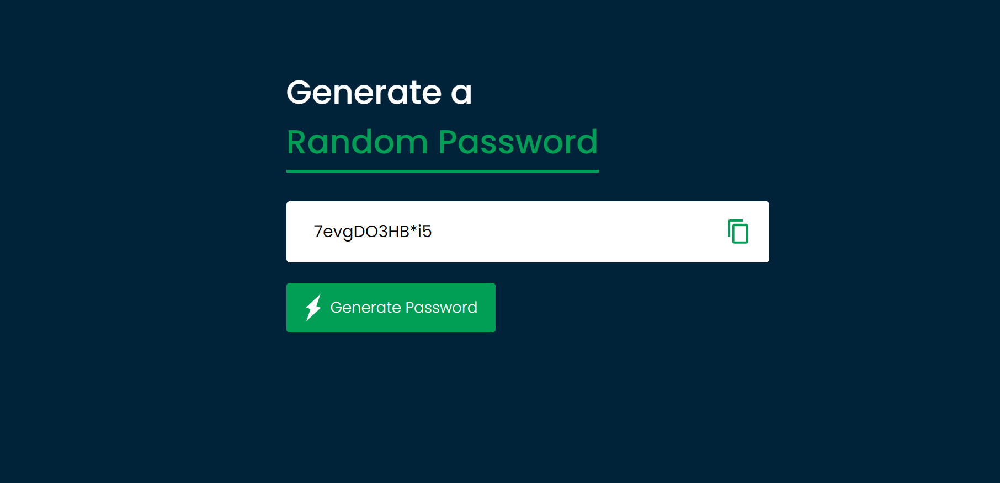

# Random Password Generator

A simple and interactive Random Password Generator application built with HTML, CSS, and JavaScript. This app allows users to generate new passwords, modify them, and copy the generated passwords.

## Visit the Website

[Random Password Generator](https://maheshhattimare.github.io/random-password-generator/)

## Features

- User-friendly interface
- Generate strong passwords
- Copy passwords to clipboard

## Technologies Used

- HTML
- CSS
- JavaScript

## Screenshots

### Interface


## Installation

1. Clone the repository:
    ```bash
    git clone https://github.com/maheshhattimare/random-password-generator.git
    ```
2. Navigate to the project directory:
    ```bash
    cd random-password-generator
    ```
3. Open `index.html` in your web browser to start the application.

## Usage

1. Open the `index.html` file in your preferred web browser.
2. Click on the "Generate Password" button to create a new password.
3. Copy the generated password by clicking on the "Copy" button.
