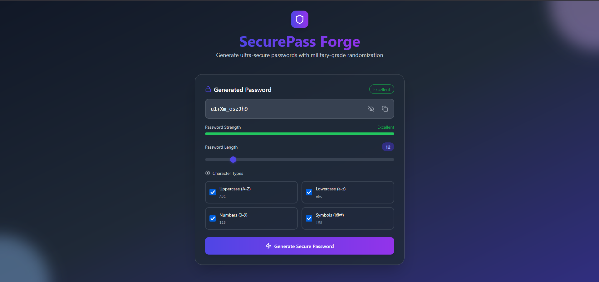

# 🔐 SecurePassForge - Advanced Password Generator

A modern, stylish, and secure password generator built using React and Tailwind CSS.

## 🔗 Live Demo

[SecurePassForge](https://secure-pass-forge.vercel.app/)

## ✨ Features

- Generate strong and secure passwords
- One-click copy to clipboard
- Minimalistic and stylish UI
- Fully responsive design

## 🛠️ Tech Stack

- React
- Tailwind CSS
- JavaScript

## 🖼️ Screenshots

### Interface



## 🚀 Installation

1. Clone the repository:

   ```bash
   git clone https://github.com/maheshhattimare/SecurePassForge.git
   ```

2. Navigate to the project directory:

   ```bash
   cd SecurePassForge
   ```

3. Install dependencies:

   ```bash
   npm install
   ```

4. Start the development server:

   ```bash
   npm run dev
   ```

5. Open your browser and go to `http://localhost:5173` to use the app.
